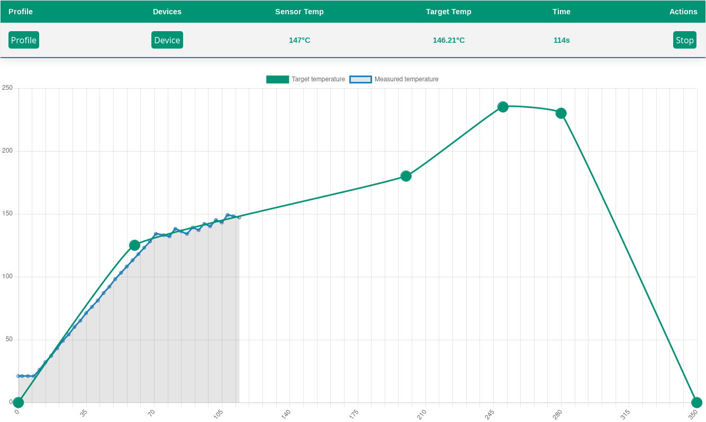

# reflow-oven-gui
A simple website hosted by a flask backend to control different reflow oven controller. The oven control is realized in Python.

## Supported devices
Currently, only the Reflow Kit V3 PRO from Beta Layout is supported as a controller. 
However, the software can easily be expanded to include other reflow controllers via interfaces

## Screenshot

## Features 
* Simulator for testing
* add/edit profiles
* Auto-detection of the correct COM port
